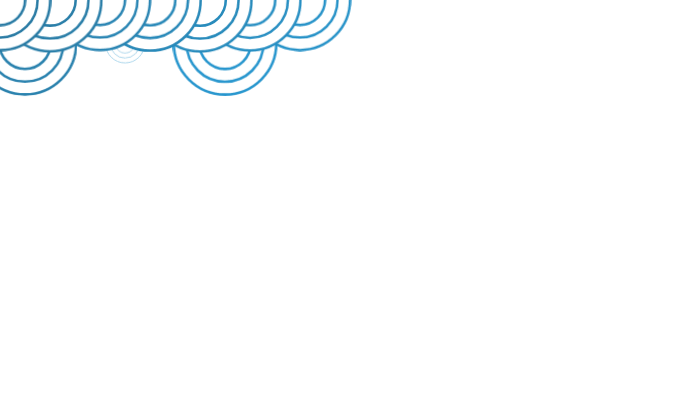

# Generative Circle Art

> Where mathematics meets organic beauty

[Live Demo](https://tommy-hylt.github.io/claude-try-doodling)

## Watch It Grow



*One circle at a time, each finding its perfect place*

## ✨ What is This?

A self-drawing canvas. Starting from a single circle, it grows organically following simple geometric rules to create unique patterns.

Each session is slightly different due to pseudo-random selection, but the mathematical harmony remains constant.

## 🎨 How It Works

Pure geometry determines where each circle goes:

- When a circle touches the canvas edge, new circles can appear at those tangent points
- When two circles meet, their intersections create new possibilities
- From all valid positions, one is chosen each step
- Circles never overlap

## 🌊 Animation

- New circles scale up from zero, appearing every 2 seconds
- All circles pulse gently, each with its own rhythm
- Newer circles render beneath older ones
- Three concentric rings per circle (100%, 75%, 50%)

## 🎯 Philosophy

Simple rules create complex beauty. Strict geometry produces organic patterns. Mathematics becomes art.

## 🚀 Run Locally

```bash
git clone https://github.com/tommy-hylt/claude-try-doodling.git
cd claude-try-doodling
npm install
npm run dev
```

## 🛠️ Built With

- React + TypeScript + SVG
- CSS animations for smooth pulsing
- Geometric intersection algorithms
- HSL color variations

---

**Made with mathematics** • [View Source](src/utils/intersections.ts)
